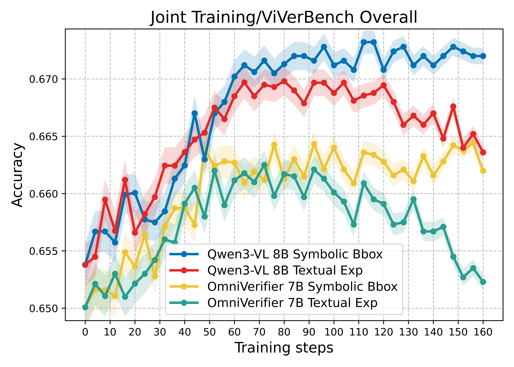
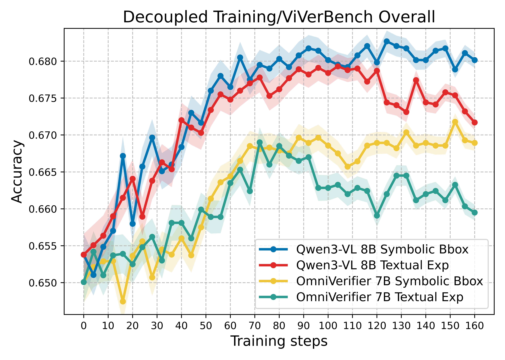

# OmniVerifier-M1_rebuttal

​                       **Figure 1. Comparison of symbolic bounding box and textual explanation as meta-verification in verifier RLVR joint training**

​                     **Figure 2. Comparison of symbolic bounding box and textual explanation as meta-verification in verifier RLVR decoupled training **

**Table1: Computational Cost Comparison between Model-Based and Rule-Based Rewards.**

| Backbone      | Reward                              | FLOPs | training time per step（min） | mean response length |
| :------------ | :---------------------------------- | ----- | ----------------------------- | -------------------- |
| OmniVerifier  | model-based（textual explanation）  |       | 10.27                         | 340                  |
| OmniVerifier  | rule-based （bbox）                 |       | 8.13                          | 384                  |
| OmniVerrifier | rule-based （point）                |       | 8.07                          | 322                  |
| Qwen3-VL 8B   | model-based（textual  explanation） |       | 11.08                         | 488                  |
| Qwen3-VL 8B   | rule-based （bbox）                 |       | 8.74                          | 516                  |
| Qwen3-VL 8B   | rule-based （point）                |       | 8.62                          | 466                  |

**Table2: Evaluation on visual generation benchmark: WISE and T2I-CoreBench.**

| Backbone                      | WISE (mean) | WISE (std) | T2I-CoreBench (mean) | T2I-CoreBench (std) |
| ----------------------------- | ----------- | ---------- | -------------------- | ------------------- |
| Qwen3-VL 8B+RePlan            | 0.643       | 0.009      | 0.626                | 0.010               |
| OmniVerifier-M1+RePlan        | 0.687       | 0.005      | 0.689                | 0.005               |
| Qwen3-VL 8B+GPT-Image-1.5     | 0.853       | 0.005      | 0.781                | 0.006               |
| OmniVerifier-M1+GPT-Image-1.5 | 0.880       | 0.000      | 0.804                | 0.004               |

**Table3: Comparison of Symbolic Rule-Based and Textual Model-Based Meta-Verification on ViverBench**

| Backbone     | Reward metric                       | ViVerbench |
| ------------ | ----------------------------------- | ---------- |
| OmniVerifier | -                                   | 0.6501     |
| OmniVerifier | textual explanation （model-based） | 0.6617     |
| OmniVerifier | bbox  （relu-based）                | 0.6613     |
| OmniVerifier | point（relu-based）                 | 0.6619     |
| Qwen3-VL-8B  | -                                   | 0.6539     |
| Qwen3-VL-8B  | textual explanation （model-based） | 0.6698     |
| Qwen3-VL-8B  | bbox  （relu-based）                | 0.6717     |
| Qwen3-VL-8B  | point（relu-based）                 | 0.6709     |

**Table4: Evaluation of Error Localization Capability on Synthetic and Real-World Data.**

| Backbone                | synthetic data | real-world data |
| ----------------------- | -------------- | --------------- |
| OmniVerifier            | 0.29           | 0.26            |
| OmniVerifier(joint)     | 0.54           | 0.49            |
| OmniVerifier(Decoupled) | 0.71           | 0.67            |
| Qwen3-VL-8B             | 0.38           | 0.32            |
| Qwen3-VL-8B (joint)     | 0.66           | 0.61            |
| Qwen3-VL-8B (Decoupled) | 0.78           | 0.73            |

**Table5: Optimization Rounds and Performance on WISE and T2I-CoreBench.**

| Backbone                        | WISE Overall | WISE Mean Round | T2I-CoreBench Overall | T2I-CoreBench Mean Round |
| ------------------------------- | ------------ | --------------- | --------------------- | ------------------------ |
| Qwen3-VL-8B + RePlan            | 0.643        | 3.945           | 0.626                 | 4.343                    |
| OmniVerifier-M1 + RePlan        | 0.687        | 1.433           | 0.689                 | 2.203                    |
| Qwen3-VL-8B + GPT-Image-1.5     | 0.853        | 2.569           | 0.781                 | 2.978                    |
| OmniVerifier-M1 + GPT-Image-1.5 | 0.880        | 0.812           | 0.804                 | 1.236                    |

**Table6: Performance of Joint and Decoupled Training on ViverBench and RefCOCO.**

| Backbone                  | ViVerBench（mean） | ViVerBench（std） | RefCOCO（mean） | RefCOCO（std） |
| ------------------------- | ------------------ | ----------------- | --------------- | -------------- |
| OmniVerifier              | 0.6501             | -                 | 0.7734          | -              |
| OmniVerifier7B(Joint)     | 0.6613             | 0.0005            | 0.7797          | 0.0021         |
| OmniVerifier7B(Decoupled) | 0.6673             | 0.0005            | 0.7917          | 0.0017         |
| Qwen3-VL8B                | 0.6539             | -                 | 0.8313          | -              |
| Qwen3-VL8B(Joint)         | 0.6717             | 0.0005            | 0.8463          | 0.0025         |
| Qwen3-VL8B(Decoupled)     | 0.6807             | 0.0005            | 0.8657          | 0.0021         |

**Table7: Analysis of Batch Size on Performance on ViverBench and RefCOCO.**

| Backbone                  | Batch Size | ViVerBench | RefCOCO |
| ------------------------- | ---------- | ---------- | ------- |
| OmniVerifier              | -          | 0.6501     | 0.7734  |
| OmniVerifier7B(Joint)     | 1 B        | 0.6610     | 0.7800  |
| OmniVerifier7B(Decoupled) | 1 B        | 0.6672     | 0.7898  |
| OmniVerifier7B(Joint)     | 1.5 B      | 0.6617     | 0.7813  |
| OmniVerifier7B(Decoupled) | 1.5 B      | 0.6680     | 0.7910  |
| Qwen3-VL8B                | -          | 0.6539     | 0.8313  |
| Qwen3-VL8B(Joint)         | 1B         | 0.6710     | 0.8470  |
| Qwen3-VL8B(Decoupled)     | 1 B        | 0.6792     | 0.8642  |
| Qwen3-VL8B(Joint)         | 1.5B       | 0.6708     | 0.8473  |
| Qwen3-VL8B(Decoupled)     | 1.5 B      | 0.6800     | 0.8660  |

